# REST API - BDD:MySQL - Lenguaje:Python - Framework:Flask

RESUMEN DE LO QUE HACE EL SISTEMA:
Es una REST API capaz de listar, registrar, actulizar, borrar y realizar diversas busquedas.
Esta es una API diseñada para un proyecto de Jornada de almuerzo gratis desarrollada para ser consumida por el equipo frontend para manejar todos lo referente a los datos de los residentes de una region y asi llevar control del almuerzo gratis que se esta repartiendo.

LIBRERIAS USADAS:

flask:Es un libreria que nos permite desarrollar un programa que se pueda ejecutar en el servidor. tiene muchas ventajas su uso y viene con jsonify(modulo para serializar a JSON) y request(objeto que contiene toda la data enviada por el cliente).

flask_mysqldb: es la cual provee la coexion de MySQL con flask.

Pasos a seguir para montar laapp en un entorno:

-Instalar administrador de base de datos para crearla y correr en local server (Para conectarse en remoto existen opciones como planetscale o cleverCloud), en mi caso utilice Xampp/phpadmin
-Correr consultas de jornada_base.sql
-Crear y activar entorno, instalar paquetes
  Paquetes a instalar o comandos utiles:
### `virtualenv -p python3 env `
### `.\env\Scripts\activate `
### `pip istall flask flask_mysqldb`
### `python .\src\app.py`

-Puedes instalar Postman, agregar extencion ThunderClient a vsc o utilizar otra plataforma que emule al cliente

 URLs de acciones y como implementarlos:

 GET  http://127.0.0.1:5000/residentes/<indice_inicio_paginacion> del metodo "obtener_residentes()":
 Muestra a todos los residentes ya registrados de 10 en 10 iniciando por el parametro actual y ordenados de mas recientes a menos.
 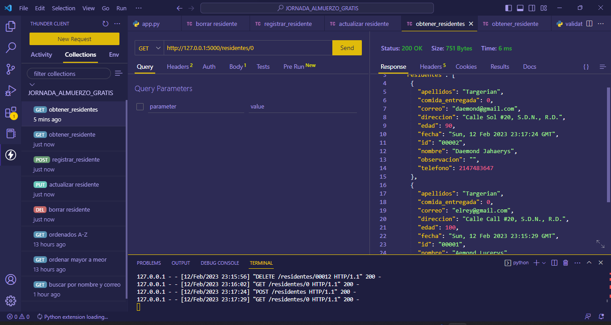

  

 GET  http://127.0.0.1:5000/residente/<id> del metodo "obtener_residente()":
 Muestra a un solo residente filtrado por el id suministrado
 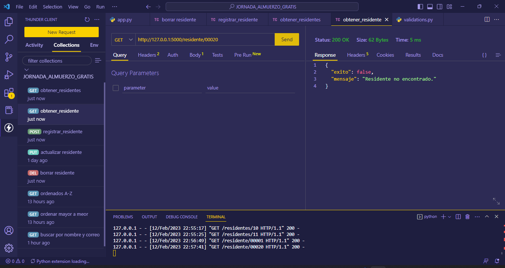
 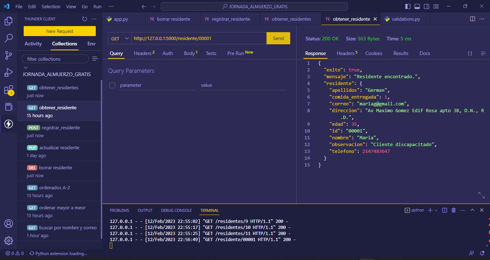
  

 GET  http://127.0.0.1:5000/residentes/byalphabet del metodo "obtener_residentes_alph()":
 Muestra a todos los residentes ya registrados ordenados por nombre en orden alfabetico. 
 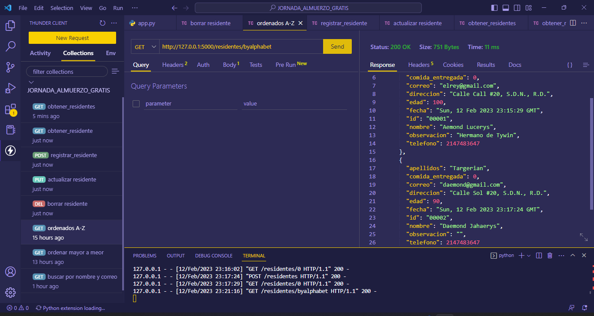
  

 GET  http://127.0.0.1:5000/residentes/byage del metodo "obtener_residentes_age()":
 Muestra a todos los residentes ya registrados ordenados por edad del mayor al menor. 
 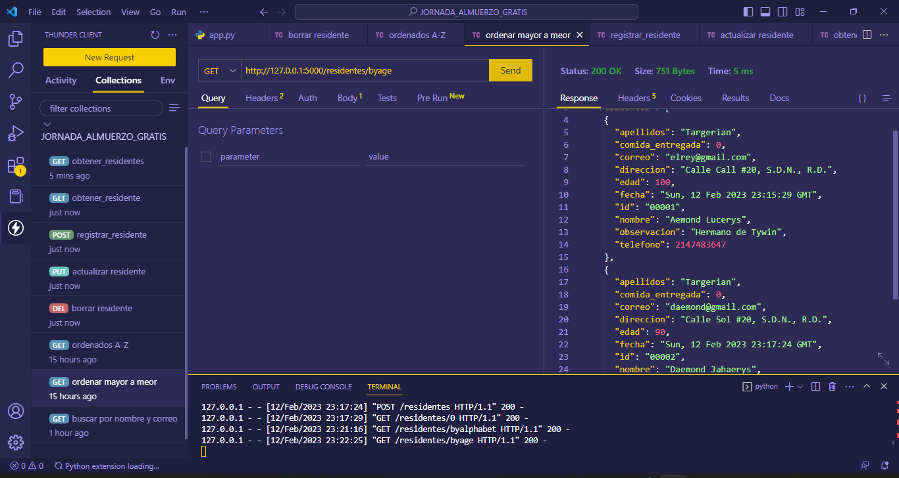
  

 GET  http://127.0.0.1:5000/residentes/search/<word> del metodo "search_by_correo_or_name()":
  Muestra a todos los residentes los cuales su nombre o correo coincida con la palabra introducida sin importar que esta se encuentre al inicio, final o centro del nombre o correo. 
 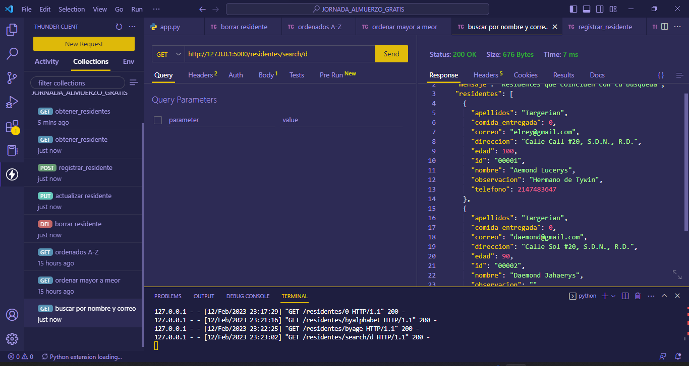
  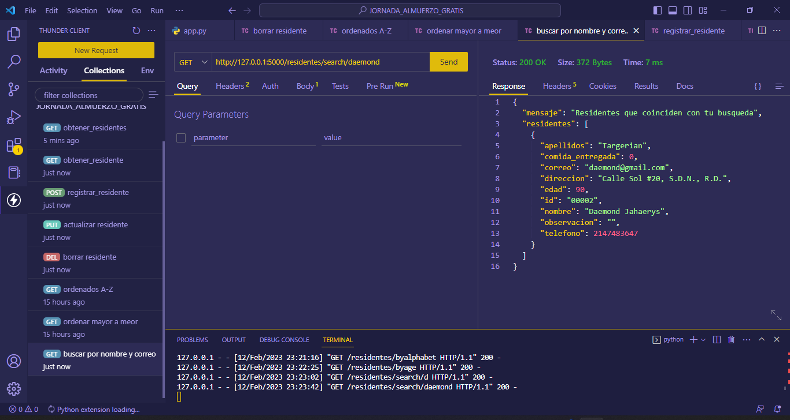
  

 POST http://127.0.0.1:5000/residentes del metodo "registrar_residentes()":
 Registra residente nuevo
 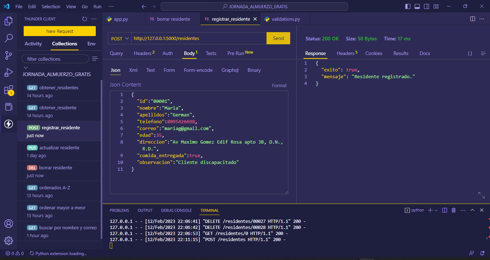
 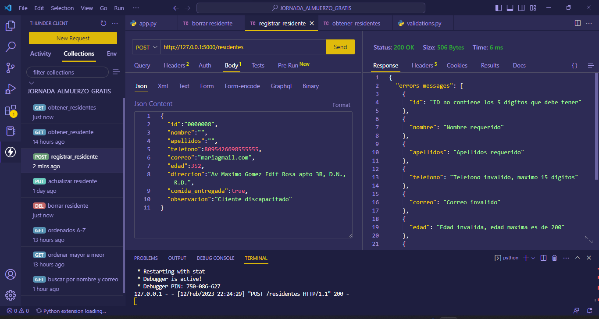
 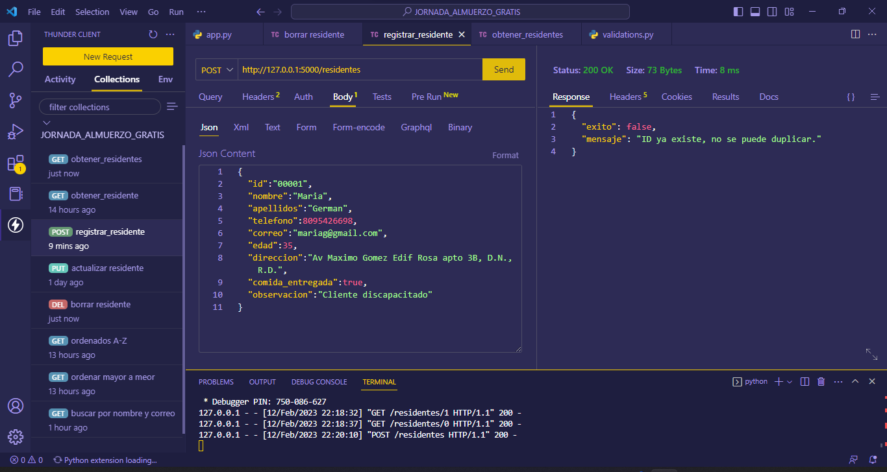
  

 PUT http://127.0.0.1:5000/residentes/<id> del metodo "actualizar_residentes()":
 Actualiza residente de id introducido
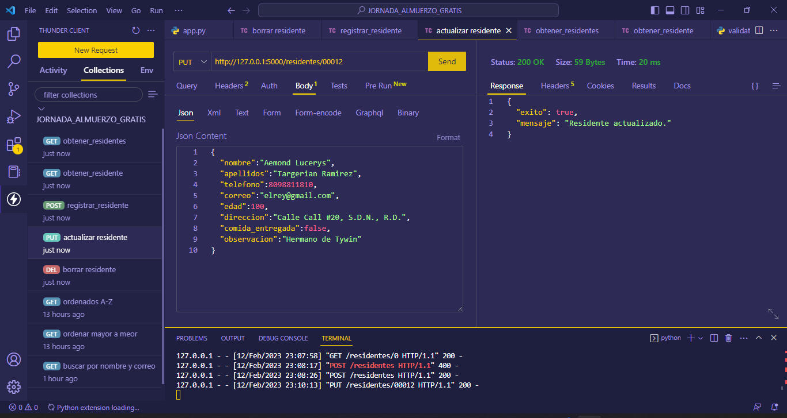
  

 DELETE http://127.0.0.1:5000/residentes/<id> del metodo "borrar_residentes()":
 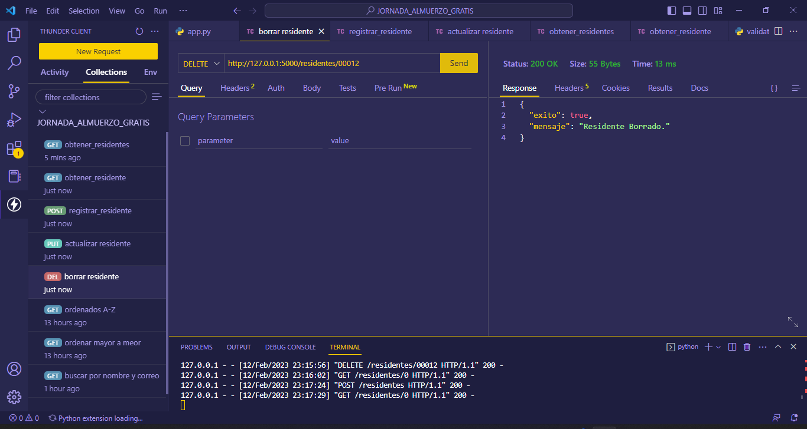

